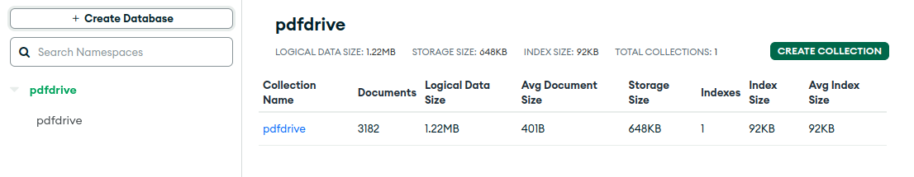

# pdfdrive
I built this project to enhance my Python skills after a long of time without coding


## what does it do

it's a web scraper that collects information on the pdfdrive.com site and then saves it in a file and in a mongodb database


## How to install

1. Install virtual env
  ```
  pip3 install virtualenv
  ```
2. Create  a virtual environment
```
virtualenv env
```
4. Activate a virtual environment
```
source enc/bin/activate
```
5. Install requirements
```
pip3 install poetry
```
6. Laucch Spider
  Before changing `.env` to your URI MongoDB and Redis
```
poetry install && cpdfdrive &&  poetry run scrapy crwal pdfdrive
```


## Run with docker

```
docker pull darixsamani/pdfdrive
docker run -it -e MONGO_URI="mongodb://localhost" -e  MONGO_DATABASE="pdfdrive" -e REDIS_HOST="localhost" -e REDIS_PORT=6379 -e REDIS_PASSWORD=""  darixsamani/pdfdrive
```

## MongoDB Screen

